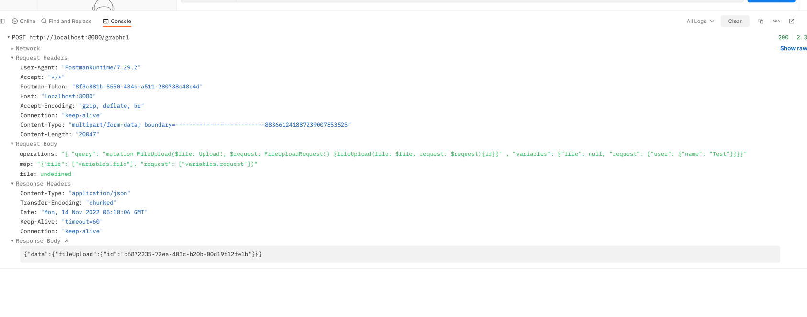

```shell
eopoku@eopoku01 graphql-multipart-demo % curl --location --request POST 'http://localhost:8080/graphql' \
--form 'operations="{ \"query\": \"mutation FileUpload($file: Upload!) {fileUpload(file: $file){id}}\" , \"variables\": {\"file\": null}}"' \
--form 'file=@"/Users/eopoku/Downloads/istockphoto-1298942276-612x612.jpg"' \
--form 'map="{\"file\": [\"variables.file\"]}"'

```

```graphql
mutation fileUpload($file:Upload!) {
  fileUpload(file: $file) {
    id
  },
},
```


